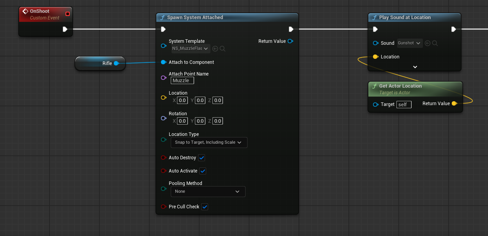
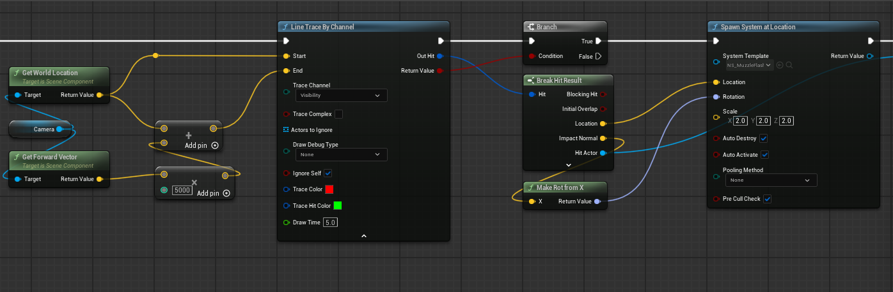
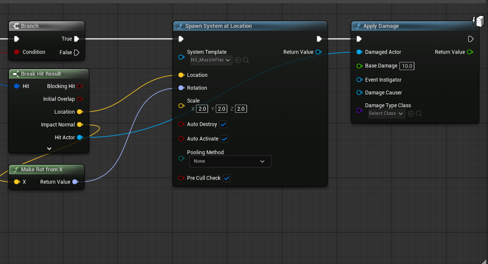
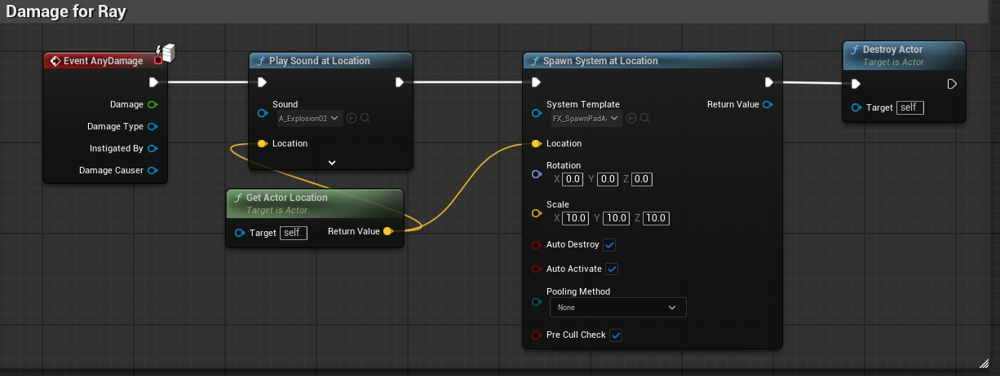
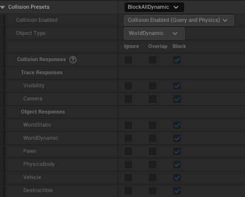

# 블루프린트 사격 시스템

## 개요
레이캐스트 기반 즉발형 사격 시스템 및 나이아가라 이펙트 구현

---

## 1. 총구 화염 및 사운드

**문제**: 이동 중 사격 시 총구 화염이 캐릭터를 따라가지 못함

**해결**: `Spawn System at Location` 대신 `Spawn System Attached`를 사용하여 소켓에 부착



| 설정 | 값 | 설명 |
|------|-----|------|
| System Template | NS_MuzzleFlash | 나이아가라 파티클 |
| Attach to Component | Rifle | 무기 메시 컴포넌트 |
| Attach Point Name | Muzzle | 소켓 이름 |
| Auto Destroy | True | 자동 파괴 (Loop 문제 해결) |
| Auto Activate | True | 자동 활성화 |

**나이아가라 Loop 문제**: `Auto Destroy`를 체크하면 파티클이 끝난 후 자동으로 파괴되어 무한 반복 문제 해결

---

## 2. 레이캐스트 피격 처리

카메라 기준 전방으로 Line Trace를 발사하여 피격 지점에 이펙트 스폰



**구현 흐름**:
1. `Get World Location` + `Get Forward Vector`로 카메라 방향 계산
2. Forward Vector에 거리(5000) 곱하여 End 지점 설정
3. `Line Trace By Channel` (Visibility 채널) 실행
4. Hit 성공 시 `Break Hit Result`로 Location, Impact Normal 추출
5. `Make Rot from X`로 Normal 방향 회전 계산
6. `Spawn System at Location`으로 피격 이펙트 스폰

---

## 3. 파괴 가능한 오브젝트

레이캐스트에 맞으면 데미지를 받고 폭발하는 타겟 액터 구현

**1단계: 데미지 전달 (사격 블루프린트)**



- `Apply Damage` 노드로 Hit Actor에 데미지 전달
- Base Damage: 10.0

**2단계: 데미지 수신 (타겟 액터)**



```
Event AnyDamage
    → Play Sound at Location (폭발음)
    → Spawn System at Location (폭발 이펙트, Scale 10.0)
    → Destroy Actor
```

**3단계: 콜리전 설정**



| 설정 | 값 |
|------|-----|
| Collision Presets | BlockAllDynamic |
| Collision Enabled | Collision Enabled (Query and Physics) |
| Object Type | WorldDynamic |
| Visibility/Camera | Block |

---

## 핵심 정리

| 기능 | 핵심 노드 | 주요 설정 |
|------|-----------|-----------|
| 총구 이펙트 | Spawn System Attached | Auto Destroy = True |
| 레이캐스트 | Line Trace By Channel | Visibility 채널 |
| 데미지 시스템 | Apply Damage / Event AnyDamage | Base Damage 설정 |

**참고**:
- 나이아가라 파티클 무한 반복 시 Auto Destroy 체크
- 콜리전은 Visibility 채널 Block 필수
