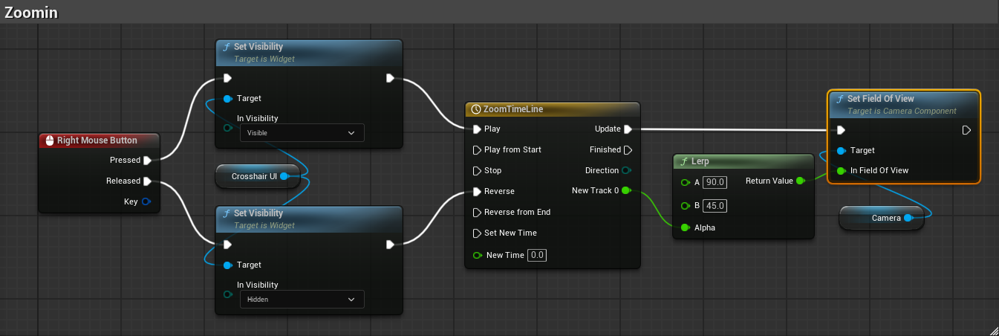

# 카메라 줌 시스템

## 개요
우클릭으로 3인칭 카메라의 FOV를 타임라인으로 부드럽게 변경하고 십자선 UI 표시

---

## 구현 방법

### 타임라인 기반 부드러운 줌인/줌아웃



**구현 흐름**:
1. `Right Mouse Button` Pressed → Crosshair UI Visible + Timeline Play
2. `Right Mouse Button` Released → Crosshair UI Hidden + Timeline Reverse
3. Timeline Update → `Lerp`(A: 90, B: 45, Alpha) → `Set Field Of View`

---

## 주요 노드 설명

| 노드 | 역할 |
|------|------|
| Right Mouse Button | 입력 이벤트 (Pressed/Released) |
| Set Visibility | Crosshair UI 표시/숨김 |
| Timeline (ZoomTimeLine) | 0→1 알파값 보간 |
| Lerp | FOV 값 보간 (90 ↔ 45) |
| Set Field Of View | 카메라 FOV 적용 |

---

## 상태별 설정

| 상태 | FOV | Crosshair UI |
|------|-----|--------------|
| 기본 | 90 | Hidden |
| 줌인 | 45 | Visible |

---

## 트러블슈팅

### Accessed None 오류 (CrosshairUI 변수)

**문제**: Crosshair UI 변수가 None으로 참조되어 Set Visibility 실패

**해결 방법**:
1. `Create Widget`으로 위젯 생성
2. 반환값을 변수에 저장 (Promote to Variable)
3. `Add to Viewport`로 화면에 추가
4. 이후 해당 변수로 Visibility 제어

```
Begin Play
    → Create Widget (CrosshairUI 클래스)
    → Set CrosshairUI 변수
    → Add to Viewport
    → Set Visibility (Hidden)
```

**참고**: 위젯 생성 전에 변수를 참조하면 Accessed None 오류 발생
