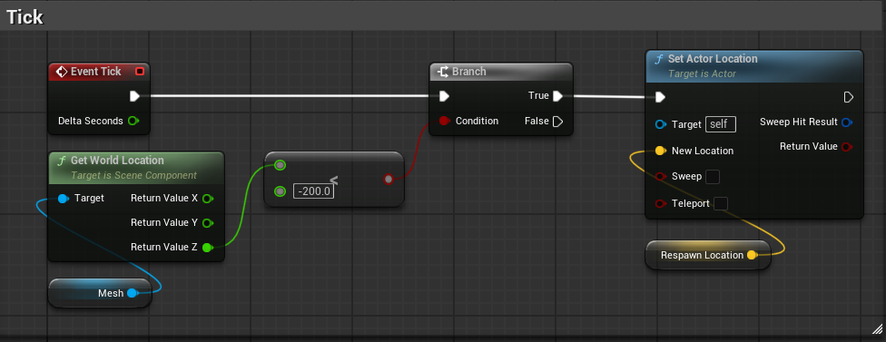

# 월드 리스폰 시스템

## 개요
Z축 좌표가 특정 값 이하로 떨어지면 안전한 위치로 재스폰하는 로직 구현

---

## 구현 방법

### 맵 밖 낙하 감지 및 재스폰

**구현 흐름**:
1. `Event Tick`에서 매 프레임 체크
2. `Get World Location` (Mesh) → Z값 추출
3. Z < -200 이면 Branch True
4. `Set Actor Location`으로 Respawn Location 이동

---

## 주요 노드 설명

| 노드 | 역할 |
|------|------|
| Event Tick | 매 프레임 실행 |
| Get World Location | 현재 위치의 X, Y, Z 값 반환 |
| < (Less Than) | Z값이 -200 미만인지 비교 |
| Branch | 조건에 따라 분기 |
| Set Actor Location | 지정된 위치로 액터 이동 |

---

## 변수 설정

| 변수 | 타입 | 설명 |
|------|------|------|
| Respawn Location | Vector | 안전한 스폰 지점 좌표 |

**Respawn Location 설정 방법**:
- 에디터에서 원하는 위치로 이동
- 해당 위치의 좌표를 복사하여 기본값으로 설정
- 또는 레벨에 배치된 Player Start 위치 사용

---

## 응용

### 다양한 낙하 기준점

| 맵 유형 | 기준 Z값 | 비고 |
|---------|----------|------|
| 일반 맵 | -200 | 바닥 아래 |
| 고층 맵 | -500 | 더 깊은 낙하 허용 |
| 플랫포머 | -100 | 빠른 리스폰 |

**참고**: 기준값은 맵 구조에 따라 조정 필요
